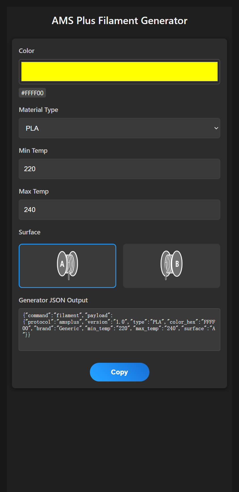

# AMS+ Filament Generator

中文 | [English](./README.md)

本项目是一个基于 **Vue** 前端 + **Node.js (Express)** 后端 搭建的示例网页，用于生成特定的 **Filament 配置信息**（输出 JSON）




## 功能概述

1. **颜色 (Color)**
   - 网页顶部可以设置颜色选择器，绑定到 `colorHex`，示例中初始值为 `#FFFF00`。
   - 生成 JSON 时会去掉 `#` 并存入 `color_hex` 字段。

2. **材质 (Material Type)**
   - 下拉框列出了若干种材料名及对应代码（如 `"PLA (GFL99)"`、`"PETG (GFG99)"`、`"TPU (GFU99)"` 等）。  
   - 通过 `v-model` 将用户选中的 `code` 存入 `type`，生成 JSON 时写入 `payload.type`。

3. **温度 (Min / Max Temp)**
   - 两个数字输入框，`min_temp` 与 `max_temp`，用户可填入材料适合的打印温度范围。

4. **表面 (Surface A/B)**
   - 互斥按钮，两个带图片的 `<label>`，可分别选中 A 或 B。  
   - 在小屏或窄页面时，按钮及图片会自适应缩放或换行，避免溢出屏幕。

5. **JSON 输出**
   - 一个 `<textarea>` 用于显示生成的 JSON。  
   - 点击 **Generate** 按钮会更新此文本；点击 **Copy** 按钮会将该文本复制到系统剪贴板。


## 技术栈

- **Vue 3**（或 Vue 2，看你当前使用的版本）  
- **Node.js (Express)**  
- **HTML/CSS**（使用 Flexbox / Media Query 实现自适应布局）


## 项目结构示例

```bash
my-filament-generator
├── client
│   ├── package.json
│   ├── vite.config.js (或 vue.config.js)
│   ├── src
│   │   ├── App.vue
│   │   ├── main.js
│   │   └── components
│   │       └── FilamentGenerator.vue
│   └── public
├── server
│   └── server.js
└── ...
```

- `client`：前端项目目录（Vue 项目）。  
- `server`：后端服务器示例（`server.js` 用 Express 来托管打包后的静态文件）。

> 结构可根据实际需要调整，比如也可把 `server.js` 放在根目录。

## 如何运行（开发环境）

1. **安装依赖**  
   ```bash
   cd client
   npm install
   # 或 yarn
   ```
2. **启动开发服务器**  
   ```bash
   npm run dev
   # 或 npm run serve, 视项目脚手架不同
   ```
3. **本地访问**  
   - 默认会在 `http://localhost:3000`（Vite）或 `http://localhost:8080`（Vue CLI） 启动一个开发服务。  
   - 如果想让**局域网**其他设备访问，需要在 `vite.config.js` 或 `vue.config.js` 中配置 `devServer.host = '0.0.0.0'`、`port = 8080` 等。


## 如何打包 & 部署

### 1. 打包

在 `client` 目录执行：

```bash
npm run build
```

将生成的静态文件放在 `dist` 文件夹（默认为此目录，也可以在 `vue.config.js` 里自定义）。

### 2. 使用 Express 托管

在 `server/server.js` 中，示例代码如下：

```js
const express = require('express');
const path = require('path');
const app = express();
const port = 8080;

// 让Express托管 dist 静态文件夹
app.use(express.static(path.join(__dirname, '../client/dist')));

// 对于所有路由，返回 index.html（适合前端路由模式）
app.get('*', (req, res) => {
  res.sendFile(path.join(__dirname, '../client/dist', 'index.html'));
});

app.listen(port, '0.0.0.0', () => {
  console.log(`Server running at http://0.0.0.0:${port}`);
});
```

启动服务器：

```bash
cd server
node server.js
```

### 3. 局域网访问

- 在命令行中查看本机 IP（如 `192.168.x.x`）。  
- 在同一局域网下，其他电脑/手机浏览器输入 `http://192.168.x.x:8080` 即可访问该页面。

若要使用 **HTTPS** 或进行更复杂的配置，可以换用 **Nginx / PM2** 等更专业的部署方式。


**祝使用愉快！**  